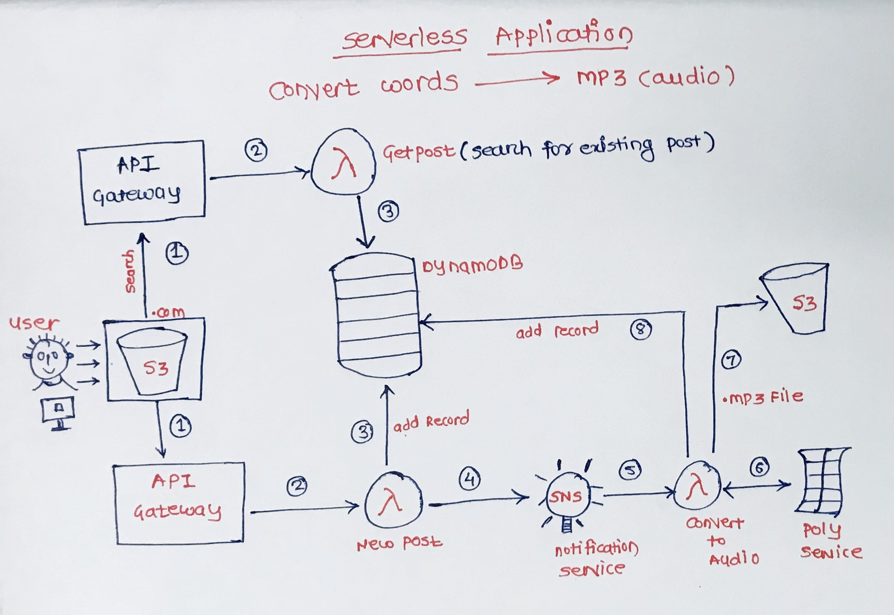
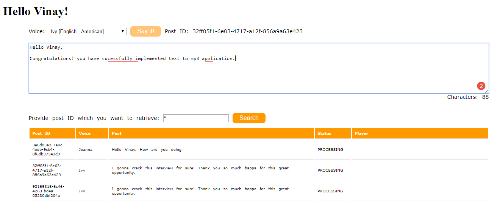
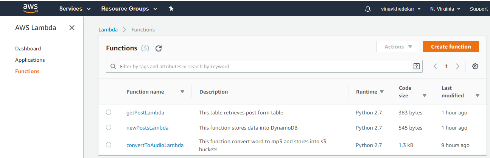
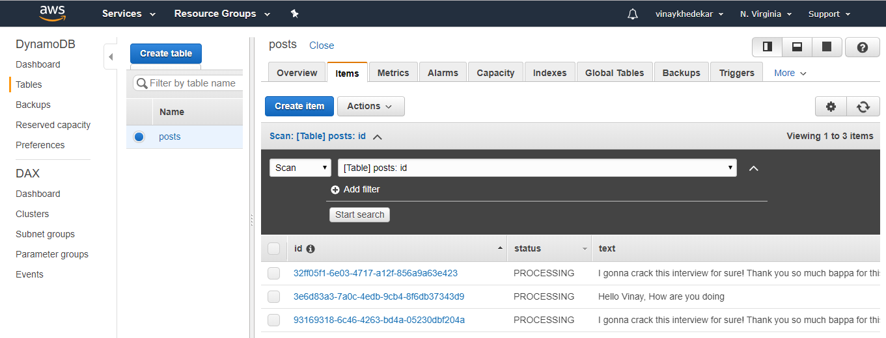

# AWS-Serverless-Convert-Text-To-Mp3

AWS hosted Serverless application designed and developed to convert text to mp3 using AWS Lambda, SNS, DynamoDb, Amazon Polly, S3 Buckets, API Gateway,  and IAM

Functionality-
1. Converts text in any language and you can listen in any language. Application provides set of languages.
2. Application allows to search for older post and listen at any time. Respective post get stored into the DynamoDB. 

Steps-
1. Create S3 bucket to host the web application. S3 bucket stores the application files including index.html, javaScript file etc.
2. Create API Gatway to communicate with dynamoDB and Lambda using REST API request
3. Create policies for Lambda and S3 which includes communication of Lambda with DynamoDB, S3, SNS, and Amazon Polly
4. Create Role which contains the policy created and attach it to the Lambda
5. Create Lambda function to store the new post request into the DynamoDB and publish the notification using AWS SNS.

6. Create another lambda function to convert text to mp3 using the Amazon polly service and store the results into S3 bucket.
7. Results of converted file are stored into another S3 buckets and post information into the DynamoDB.

